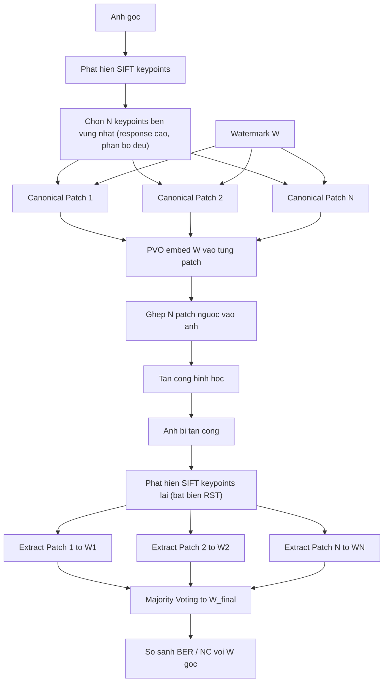
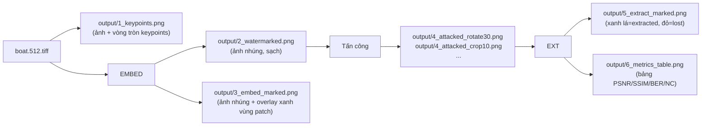

# Kỹ thuật chống tấn công hình học cho thủy vân số dựa vào SIFT và PVO

## Kiến trúc tổng thể



## Nguyên lý cốt lõi

### SIFT Canonical Patch — bất biến với geometric attack

SIFT mỗi keypoint đính kèm `(x, y, σ, θ)`. Ta cắt **canonical patch** bằng cách xoay vùng ảnh theo `-θ` và scale về kích thước cố định dựa trên `σ`.

Sau tấn công hình học (ví dụ xoay α): keypoint được phát hiện lại với `θ' = θ + α`. Canonical patch rút ra với `θ'` trông **giống hệt** patch lúc nhúng → PVO extract đúng.

### Chiến lược Repetition + Majority Voting

- **Nhúng**: cùng 1 watermark W vào **tất cả N patch** (redundant)
- **Extract**: thu M bản watermark (M ≤ N patch sống sót) → bit-wise majority vote
- **Lợi ích**: crop mất 70% patch → 30% còn lại vẫn cho kết quả đúng

## Cấu trúc file dự án

```
watermarking_with_SIFT_and_PVO/
├── data/
│   └── gray/                # USC-SIPI grayscale .tiff images (đã có sẵn)
│       ├── boat.512.tiff    # Ảnh test chính (512x512)
│       ├── 7.1.01.tiff      # Ảnh test thêm
│       └── ...              # ~90 ảnh tiff khác
├── src/
│   ├── sift_utils.py        # Phát hiện SIFT, trích/ghép canonical patch
│   ├── pvo.py               # Thuật toán PVO embed/extract (block 3x3)
│   ├── watermark_embed.py   # Pipeline: chọn N keypoints → PVO vào N patch
│   └── watermark_extract.py # Pipeline: detect keypoints → extract → majority vote
├── utils/
│   ├── attacks.py           # Mô phỏng các tấn công hình học
│   ├── metrics.py           # PSNR, SSIM, BER, NC
│   └── visualize.py         # Vẽ đồ thị, keypoints, patch visualization
├── output/                  # Tự tạo khi chạy
│   ├── 1_keypoints.png      # Ảnh gốc + vòng tròn đánh dấu N keypoints
│   ├── 2_watermarked.png    # Ảnh sau khi nhúng (bình thường, không đánh dấu)
│   ├── 3_embed_marked.png   # Ảnh sau khi nhúng + highlight vùng patch đã nhúng
│   ├── 4_attacked_*.png     # Ảnh bị tấn công (rotate/scale/crop/...)
│   └── 5_extract_marked.png # Ảnh bị tấn công + highlight các patch trích xuất được
├── demo.ipynb               # Jupyter notebook demo đầy đủ
├── main.py                  # CLI script chạy nhanh
└── requirements.txt
```

**Ảnh test chính**: `data/gray/boat.512.tiff` (512×512, texture phong phú → SIFT cho nhiều keypoints tốt).

**Ảnh batch test** (đánh giá trên nhiều ảnh): `boat.512`, `7.1.01` → `7.1.10`, `5.1.09` → `5.1.14`.

## Thuật toán chi tiết

### 1. Chọn N keypoints (`sift_utils.py`)

- Phát hiện tất cả keypoints bằng `cv2.SIFT_create()`
- Sắp xếp giảm dần theo `response` (độ bền vững)
- Chọn N=20 keypoints cao nhất, đảm bảo khoảng cách tối thiểu giữa các tâm patch (không overlap)
- Lưu keypoints vào file `.pkl` để dùng khi extract

### 2. Trích/ghép canonical patch (`sift_utils.py`)

**Trích patch** tại keypoint `k = (x, y, σ, θ)`:

- Tính `r = patch_size * σ * 2.5` (bán kính vùng lấy)
- Tạo affine matrix: xoay `-θ` quanh `(x,y)`, scale về `patch_size`
- `warpAffine` → cắt vùng `patch_size × patch_size` tại tâm

**Ghép patch ngược**: áp dụng inverse transform để dán patch đã sửa trở lại ảnh gốc

### 3. PVO Embedding/Extraction (`pvo.py`)

Chia patch `32×32` thành các block `3×3` (~100 blocks = 100 bits/patch):

**Embed** mỗi bit vào 1 block:

- Sắp xếp 9 pixel: `p[0] ≤ ... ≤ p[8]`
- `p_max = p[8]`, `p_min = p[0]`, `p_med = p[4]`
- bit=1 → `p_max += 1` (nếu `p_max < 255`)
- bit=0 → `p_min -= 1` (nếu `p_min > 0`)

**Extract** bit từ block:

- Nếu `p_max - p_med > p_med - p_min` → bit = 1, ngược lại → bit = 0

### 4. Majority Voting (`watermark_extract.py`)

```python
votes = sum(list_of_extracted_watermarks)   # shape: (wm_bits,)
W_final = (votes > num_surviving_patches / 2).astype(int)
```

### 5. Các tấn công hình học (`utils/attacks.py`)

- `rotate(img, angle)` — xoay, giữ kích thước gốc
- `scale(img, factor)` — co giãn rồi resize về kích thước gốc
- `translate(img, tx, ty)` — dịch chuyển
- `crop(img, ratio)` — cắt `ratio` mỗi cạnh rồi resize
- `affine(img, ...)` — biến đổi affine tổng quát

### 6. Visualization outputs (`utils/visualize.py`)

**`draw_keypoints(img, keypoints) → output/1_keypoints.png`**

- Vẽ vòng tròn tại mỗi keypoint với bán kính tỉ lệ theo `σ` (scale)
- Vẽ đường thẳng nhỏ từ tâm theo hướng `θ` (orientation)
- Dùng `cv2.drawKeypoints(..., flags=DRAW_RICH_KEYPOINTS)`

**`draw_embedded_patches(img, keypoints) → output/2_watermarked.png + output/3_embed_marked.png`**

- `2_watermarked.png`: ảnh đã nhúng thủy vân, không có đánh dấu
- `3_embed_marked.png`: ảnh đã nhúng + vẽ hình vuông/tròn bán trong suốt (overlay màu xanh) lên vùng patch đã nhúng, kèm số thứ tự patch

**`draw_extracted_patches(attacked_img, surviving_keypoints, failed_keypoints) → output/5_extract_marked.png`**

- Vẽ vòng tròn **xanh lá** tại các keypoint trích xuất thành công
- Vẽ vòng tròn **đỏ** tại các keypoint bị mất sau tấn công (không detect được)
- Chú thích tỉ lệ: "Extracted: M/N patches"

### 7. Metrics đánh giá (`utils/metrics.py`)

- **PSNR** ≥ 40 dB: ảnh sau nhúng không lộ
- **SSIM** ≥ 0.99: cấu trúc gần như nguyên vẹn
- **BER** → 0%: extract chính xác sau tấn công
- **NC** → 1.0: watermark tương quan hoàn hảo

## Luồng output đầy đủ khi chạy



## Stack công nghệ

- Python 3.10+
- `opencv-contrib-python` (SIFT, warpAffine)
- `numpy`, `scipy`
- `scikit-image` (SSIM)
- `matplotlib` (visualization)
- `jupyter` (notebook)
- `Pillow` (image I/O)
