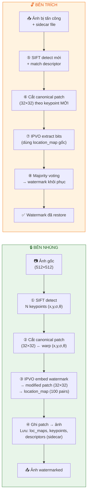
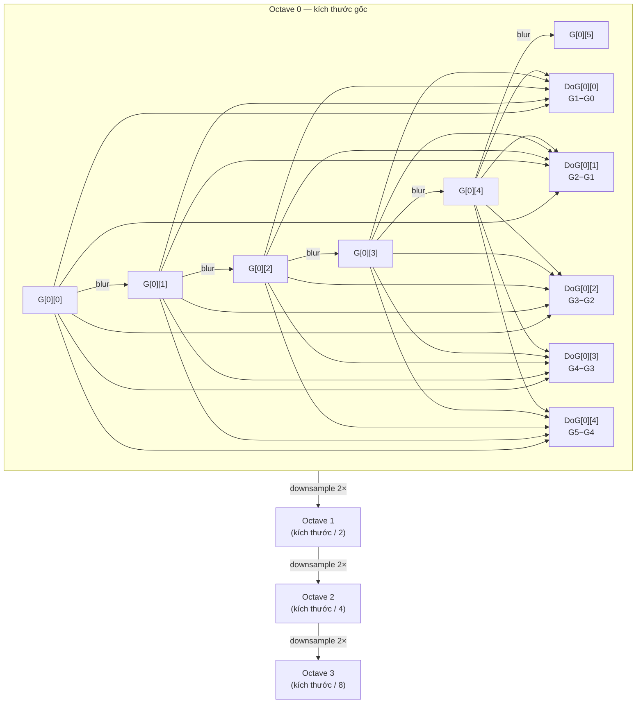
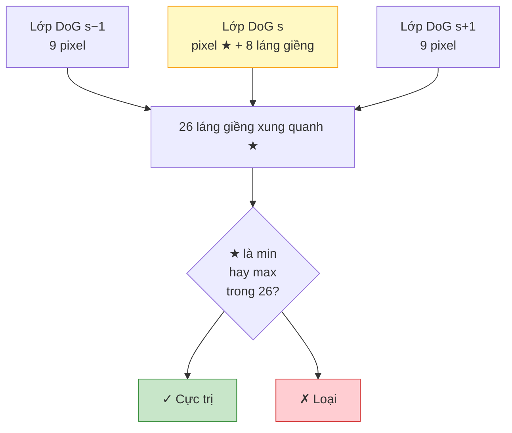
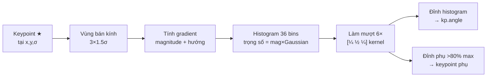
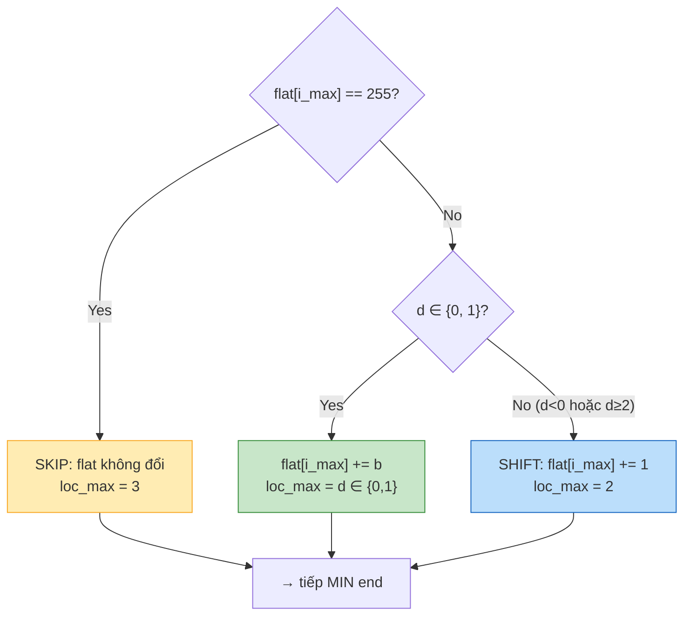
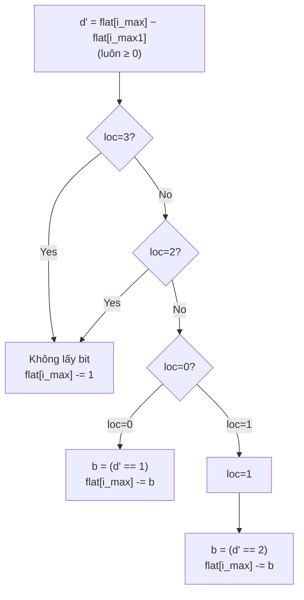
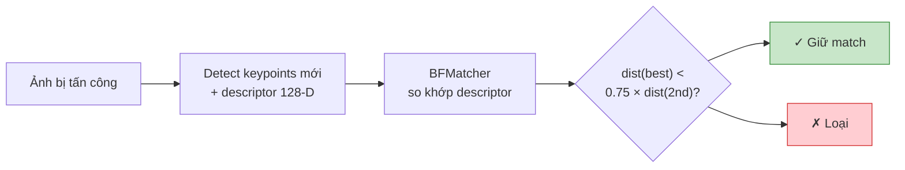
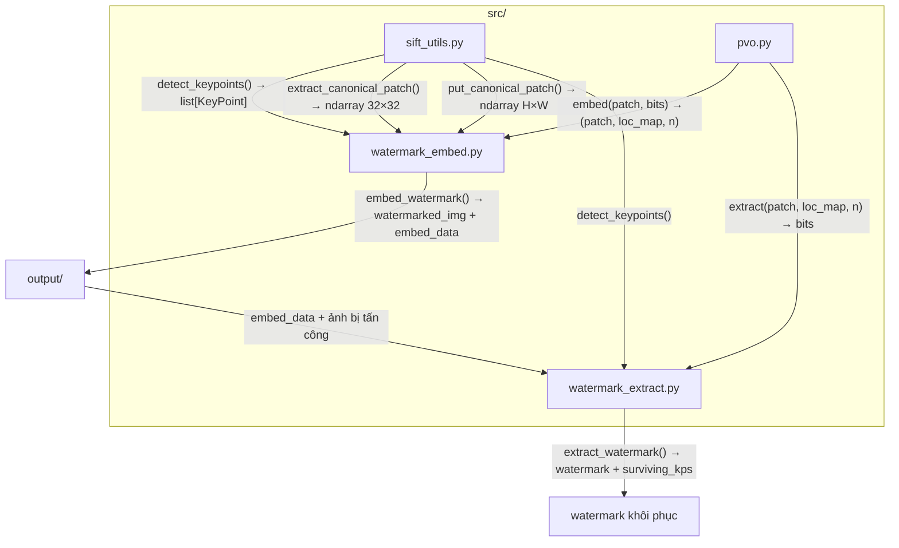

# Watermarking với SIFT + IPVO

> **Tóm tắt:** Nhúng một chuỗi bit (watermark) vào ảnh xám theo cách **reversible** (có thể khôi phục ảnh gốc). Dùng **SIFT** để chọn vị trí nhúng ổn định, **IPVO** để nhúng/trích bit với thay đổi tối thiểu (±1 pixel).

---

## Mục lục

1. [Kiến trúc tổng thể](#1-kiến-trúc-tổng-thể)
2. [SIFT — Detect Keypoints](#2-sift--detect-keypoints)
3. [Canonical Patch — Khái niệm và cách trích](#3-canonical-patch--khái-niệm-và-cách-trích)
4. [Cấu trúc Patch và Block](#4-cấu-trúc-patch-và-block)
5. [IPVO — Embed](#5-ipvo--embed)
6. [Location Map — Tại sao không thể bỏ?](#6-location-map--tại-sao-không-thể-bỏ)
7. [IPVO — Extract](#7-ipvo--extract)
8. [Embed vào Ảnh và Ghi Ngược](#8-embed-vào-ảnh-và-ghi-ngược)
9. [Trích Watermark sau Tấn công](#9-trích-watermark-sau-tấn-công)
10. [Tại sao SIFT + IPVO?](#10-tại-sao-sift--ipvo)
11. [Sơ đồ dữ liệu giữa các file](#11-sơ-đồ-dữ-liệu-giữa-các-file)
12. [Tóm tắt tham số](#12-tóm-tắt-tham-số)

---

## 1. Kiến trúc tổng thể



---

## 2. SIFT — Detect Keypoints

### 2.1 Keypoint là gì?

Một **keypoint** là điểm đặc trưng, biểu diễn bằng 4 thông số:

| Thông số | Ký hiệu | Ý nghĩa |
|---|---|---|
| Vị trí | `(x, y)` | Tọa độ pixel trong ảnh |
| Scale | `σ` | Bán kính vùng ảnh xung quanh (Lowe: `kp.size = 2σ`) |
| Hướng | `θ` | Góc chủ đạo của gradient (0°–360°) |
| Độ mạnh | `response` | Giá trị DoG tại điểm đó |

> **Tại sao cần θ và σ?**
> Khi ảnh bị xoay hoặc phóng to/thu nhỏ, `θ` và `σ` thay đổi tương ứng. Nhờ đó canonical patch luôn trích được vùng ảnh **giống nhau**, bất kể phép biến đổi.

### 2.2 Pipeline SIFT (tự cài đặt)

#### Bước 1 — Scale-Space (Gaussian Pyramid + DoG)



- **Gaussian image** `G[σ]`: ảnh làm mờ với sigma tăng dần (σ = σ₀ × kˢ)
- **DoG** = `G(s+1) − G(s)`: xấp xỉ Laplacian of Gaussian → phát hiện blob/corner
- Mỗi octave: **S+3** ảnh Gaussian, **S+2** DoG (trong code: S=3 → 6 Gaussian, 5 DoG)

#### Bước 2 — Tìm cực trị 3D (x, y, scale)



Pixel tại `(y, x, s)` là cực trị **khi và chỉ khi** nó là min hoặc max trong **tất cả 26 láng giềng** (8 cùng tầng + 9 trên + 9 dưới).

#### Bước 3 — Tinh chỉnh sub-pixel (Taylor expansion)

Vị trí cực trị thực không nằm đúng pixel nguyên. Giải:

$$\delta = -H^{-1} \nabla D$$

với `H` là Hessian 3×3 của DoG tại `(s, y, x)`. Lặp tối đa 5 lần.

Sau đó lọc bỏ keypoint:

| Filter | Điều kiện loại | Ý nghĩa |
|---|---|---|
| **Contrast** | `\|D(x+δ)\| < threshold / S` | Điểm quá mờ / gần phẳng |
| **Edge** | `Tr(H_xy)² / Det(H_xy) ≥ (r+1)² / r` | Nằm trên cạnh dài, không ổn định |

#### Bước 4 — Gán hướng (Orientation Assignment)



- Gradient tại mỗi pixel trong vùng
- Trọng số = magnitude × Gaussian(dist từ tâm)
- Histogram 36 bins (mỗi bin = 10°)
- Đỉnh cao nhất → `θ` chính; đỉnh phụ trên 80% → tạo thêm keypoint

#### Bước 5 — Lọc chọn N keypoint tốt nhất

```python
# 1. Sắp xếp theo response giảm dần
# 2. Patch phải nằm hoàn toàn trong ảnh:
#       x ± (σ × 6 + 2) < biên
# 3. Cách nhau ít nhất MIN_KP_DIST = 38.4 px (tránh chồng patch)
```

---

## 3. Canonical Patch — Khái niệm và cách trích

### 3.1 Tại sao cần "canonical"?

**Vấn đề:** Nếu ảnh bị xoay 30°, patch cắt thẳng tại `(x, y)` sẽ chứa **nội dung hoàn toàn khác** so với trước khi xoay.

**Giải pháp:** Canonical patch được cắt **theo hệ tọa độ của keypoint**:
- Luôn hướng theo `θ` (orientation)
- Luôn scale theo `σ` (scale)

→ Khi ảnh xoay, `θ` thay đổi tương ứng → patch vẫn "nhìn thấy" cùng một vùng nội dung.

### 3.2 Ma trận affine M

Để cắt canonical patch, xây ma trận `M` (2×3) ánh xạ:

$$\begin{pmatrix} i_x \\ i_y \end{pmatrix} = M \begin{pmatrix} p_x \\ p_y \\ 1 \end{pmatrix}$$

$$M = \begin{bmatrix} \cos(-\theta) \cdot s & -\sin(-\theta) \cdot s & t_x \\ \sin(-\theta) \cdot s & \cos(-\theta) \cdot s & t_y \end{bmatrix}$$

Trong đó:
- $s = \dfrac{PATCH\_SIZE / 2}{\sigma \times SCALE\_FACTOR}$ — tỉ lệ scale
- `rotate -θ` để align với hướng keypoint
- $t_x, t_y$ — dịch để keypoint nằm đúng tâm patch `(16, 16)`


### 3.3 Tại sao dùng `INTER_NEAREST`?

Mỗi pixel patch được lấy từ **đúng 1 pixel** ảnh (nearest neighbor, không nội suy).

→ Khi IPVO sửa pixel patch đi ±1, ta biết **chính xác** pixel nào trong ảnh gốc bị sửa → ghi ngược đúng vị trí.

Nếu dùng bilinear/bicubic: pixel patch là tổng có trọng số của nhiều pixel ảnh → **không thể ghi ngược chính xác** → PSNR giảm.

---

## 4. Cấu trúc Patch và Block

```
PATCH (32×32 pixels)                        BLOCK (3×3 = 9 pixels)
┌──────────────────────────────────┐         ┌───────────────────┐
│ B B B │ B B B │ B B B │ …       │         │ 120  85  200 │
│ B B B │ B B B │ B B B │         │  → flat [120, 85, 200,
│ B B B │ B B B │ B B B │         │           45, 110, 170,
│───────┼───────┼───────┤         │           90, 155, 130]
│ B B B │ B B B │ B B B │         │
│ B B B │ B B B │ B B B │         │  argsort asc (stable):
│ B B B │ B B B │ B B B │         │  sorted: [45, 85, 90, 110, 120, 130, 155, 170, 200]
│───────┼───────┼───────┤         │  pos:     [3,  1,  6,   4,   0,   8,   7,   5,   2]
│  …                                │                                    ↑         ↑
└──────────────────────────────────┘                              i_max1=5   i_max=2
  10 rows × 10 cols = 100 BLOCKS                              (170)       (200)
  100 blocks × 2 bits = 200 bits/patch                    i_min=3    i_min1=1
                                                         (45)        (85)
```

---

## 5. IPVO — Embed

### 5.1 Ý tưởng cốt lõi

Với mỗi block 3×3:
- **Đầu MAX**: tác động lên pixel **lớn nhất** (`±1`)
- **Đầu MIN**: tác động lên pixel **nhỏ nhất** (`±1`)
- Mỗi đầu nhúng **1 bit** → tối đa **2 bits/block**

Thay đổi tối thiểu → **PSNR cao** → ảnh watermarked gần như giống hệt gốc.

### 5.2 Quy tắc nhúng IPVO (MAX end)

Sau sort ascending: $x_{\sigma(1)} \leq x_{\sigma(2)} \leq \cdots \leq x_{\sigma(9)}$

Lấy 2 pixel lớn nhất:
- `i_max` = vị trí của max trong flat array
- `i_max1` = vị trí của 2nd max

Tính:
- `u = min(i_max, i_max1)`, `v = max(i_max, i_max1)`
- `d = flat[u] - flat[v]` ← **có thể âm**



> **Chú ý IPVO:** `d = −1` (gap=1 nhưng max ở chỉ số lớn hơn) → **shift**, không embed. Đây là điểm cải tiến của IPVO so với PVO gốc.

**MIN end** (tương tự, nhưng sau khi **re-sort**):
- `d_min = flat[s] - flat[t]` với `s = min(i_min, i_min1)`, `t = max(i_min, i_min1)`
- Embed nếu `d_min ∈ {0, 1}`: `flat[i_min] -= b`, `loc_min = d_min`
- Shift/skip nếu không

### 5.3 Ví dụ số

```
Block: [120, 85, 200, 45, 110, 170, 90, 155, 130]

sorted: [45, 85, 90, 110, 120, 130, 155, 170, 200]
pos:     3   1   6    4    0    8    7    5    2
                                             ↑    ↑
                                        i_max1=5  i_max=2

MAX end:
  u = min(2, 5) = 2,  v = max(2, 5) = 5
  d = flat[2] - flat[5] = 200 - 170 = 30  ←  d ≥ 2 → SHIFT
  flat[2] = 200 + 1 = 201
  loc_max = 2

Re-sort: [45, 85, 90, 110, 120, 130, 155, 170, 201]
                                              ↑    ↑
                                        i_min=3  i_min1=1

MIN end:
  s = min(3, 1) = 1,  t = max(3, 1) = 3
  d = flat[1] - flat[3] = 85 - 45 = 40  ←  d ≥ 2 → SHIFT
  flat[3] = 45 - 1 = 44
  loc_min = 2

Kết quả: [120, 85, 201, 44, 110, 170, 90, 155, 130]
loc = (2, 2)  ← block này không nhúng được bit nào
```

---

## 6. Location Map — Tại sao không thể bỏ?

### 6.1 Vấn đề cốt lõi

Tại extraction time, bên trích **không biết** watermark bits (đó là thứ cần tìm).

Nhìn vào block sau khi nhúng, tính `d' = flat[i_max] - flat[i_max1]`, thấy `d' = 1`:

| Lịch sử thực tế | Hành động cần làm |
|---|---|
| Embed với d=0, b=1 | Lấy bit **1**, restore max -= 1 |
| Embed với d=1, b=0 | Lấy bit **0**, restore max giữ nguyên |
| Shift với d=−1 | **Không có bit**, restore max -= 1 |

Ba trường hợp → cùng `d' = 1` → cần `loc` để phân biệt.

### 6.2 Cấu trúc Location Map

```
loc_map = [(loc_max, loc_min), (loc_max, loc_min), ...]
           block 0              block 1             ...

Tổng cộng: 100 phần tử cho 1 patch 32×32

Mỗi loc ∈ {0, 1, 2, 3}:
  0 → embed với d = 0
  1 → embed với d = 1
  2 → shift
  3 → biên (255 hoặc 0)
```

---

## 7. IPVO — Extract

### 7.1 Quy tắc trích (MAX end)



MIN end: tương tự, `d' = flat[i_min1] - flat[i_min]`, restore với `+b`.

### 7.2 Bảng chứng minh đúng đắn

| Lúc embed | d gốc | b | x' | d' quan sát | b trích | restore |
|---|---|---|---|---|---|---|
| loc=0 | 0 | 0 | x | 0 | `(d'==1)=0` ✓ | x'−0=x ✓ |
| loc=0 | 0 | 1 | x+1 | 1 | `(d'==1)=1` ✓ | x'−1=x ✓ |
| loc=1 | 1 | 0 | x | 1 | `(d'==2)=0` ✓ | x'−0=x ✓ |
| loc=1 | 1 | 1 | x+1 | 2 | `(d'==2)=1` ✓ | x'−1=x ✓ |
| loc=2 | ∉{0,1} | — | x+1 | — | None | x'−1=x ✓ |

---

## 8. Embed vào Ảnh và Ghi Ngược

### 8.1 Luồng hoàn chỉnh trong `embed_watermark`

```python
keypoints = detect_keypoints(img, N=20)
# ↑ N keypoint → watermark được nhúng N lần (redundancy)

for kp in keypoints:
    patch = extract_canonical_patch(img, kp)          # cắt patch 32×32
    modified_patch, loc_map, n = pvo.embed(patch, watermark)
    img_out = put_canonical_patch(img_out, kp, modified_patch)

embed_data = {
    'keypoints':     keypoints,
    'descriptors':   descriptors,    # 128-D SIFT descriptor mỗi kp
    'location_maps': [loc_map_kp0, loc_map_kp1, ...],
    'watermark':     watermark,
}
```

### 8.2 Ghi patch ngược (`put_canonical_patch`)

```
Với mỗi pixel patch (px, py):

  [ix]   [cos_a  -sin_a  tx] [px]
  [iy] = [sin_a   cos_a  ty] [py]
                               [1 ]

  → pixel ảnh tại (ix, iy) = pixel patch (px, py) đã modified
```

Cách này chỉ ghi đúng **32×32 = 1024** pixel ảnh, không ảnh hưởng vùng khác (khác với `warpAffine` ghi đè rất nhiều pixel trùng lắp).

---

## 9. Trích Watermark sau Tấn công

### 9.1 Vấn đề khi ảnh bị tấn công

Sau khi xoay/crop/noise, keypoint gốc tại `(x, y, θ)` không còn ở đúng vị trí. Nếu dùng lại keypoint gốc để cắt patch → nội dung patch sai → extract sai.

### 9.2 SIFT Descriptor Matching (Lowe Ratio Test)



**Descriptor 128-D**: chia vùng 16×16 quanh keypoint thành lưới 4×4 ô, mỗi ô có histogram gradient 8 bins → 4×4×8 = 128 giá trị. Descriptor **bất biến với xoay, scale, thay đổi độ sáng nhỏ**.

### 9.3 Majority Voting

```
Mỗi keypoint matched → extract ra 1 bản watermark (có thể nhiễu)

votes = [0, 0, 0, ..., 0]   ← tổng vote cho từng bit

for mỗi keypoint survived:
    bits = pvo.extract(patch, loc_map, wm_length)
    votes += bits                          # thêm vote

watermark_final = (votes > count / 2)     # đa số quyết định
```

```
Keypoint 1: [1, 0, 1, 1, 0, 1, ...]   ← đúng
Keypoint 2: [1, 0, 1, 1, 0, 1, ...]   ← đúng
Keypoint 3: [1, 1, 1, 0, 0, 1, ...]   ← bị nhiễu bit 1, 3
Keypoint 4: [0, 0, 1, 1, 0, 1, ...]   ← bị nhiễu bit 0
───────────────────────────────────────
votes:       [3, 1, 4, 3, 0, 4, ...]
count = 4     threshold = 2
result:      [1, 0, 1, 1, 0, 1, ...]  ✓
```

---

## 10. Tại sao SIFT + IPVO?

| Yêu cầu | Giải pháp |
|---|---|
| Nhúng vào vùng ổn định | SIFT chọn keypoint có response cao, không chồng nhau |
| Chống xoay/scale | Canonical patch theo `(σ, θ)` của keypoint |
| Khôi phục keypoint sau tấn công | SIFT descriptor matching |
| Thay đổi ảnh tối thiểu | IPVO chỉ `±1` pixel → PSNR ≈ 50–55 dB |
| Có thể khôi phục ảnh gốc | IPVO reversible (với location_map) |
| Chịu được một số keypoint bị mất | Majority voting trên N keypoint |

---

## 11. Sơ đồ dữ liệu giữa các file



**Chi tiết `embed_data`:**

```
embed_data: {
  'keypoints':     list[cv2.KeyPoint]      # N keypoint
  'descriptors':   ndarray (N, 128)         # SIFT descriptor
  'location_maps': list[list[(0..3, 0..3)]] # 100 pairs / keypoint
  'watermark':     ndarray (wm_bits,)       # watermark gốc
  'patch_size':    32
  'n_embedded':    list[int]               # bits thực sự nhúng / keypoint
}
```

---

## 12. Tóm tắt tham số

| Tham số | Giá trị | Ý nghĩa |
|---|---|---|
| `PATCH_SIZE` | 32 | Patch 32×32 pixel |
| `BLOCK_SIZE` | 3 | Block 3×3 pixel |
| Số block/patch | 100 | `(32//3)² = 10²` |
| Capacity/patch | 200 bits | `100 × 2` |
| `SCALE_FACTOR` | 6.0 | Vùng ảnh = `6σ` pixel → tâm patch |
| `MIN_KP_DIST` | 38.4 px | Khoảng cách tối thiểu giữa 2 keypoint |
| Số keypoint mặc định | 20 | Watermark nhúng 20 lần |
| `σ₀` | 1.6 | Sigma khởi đầu SIFT |
| Số octave | 4 | Số tầng pyramid |
| Số scale/octave | 3 | Intervals per octave |
| `CONTRAST_THRESH` | 0.04 | Ngưỡng lọc contrast |
| `EDGE_THRESH_R` | 10.0 | Tỉ lệ principal curvature threshold |

---

## Lệnh chạy nhanh

```bash
# Chạy đầy đủ
python main.py --image data/gray/boat.512.tiff --n_keypoints 20 --wm_bits 16

# Xuất debug SIFT
python main.py --dump_sift_steps

# Xuất debug watermark
python main.py --dump_watermark_debug

# Cả hai cùng lúc
python main.py --dump_sift_steps --dump_watermark_debug
```
